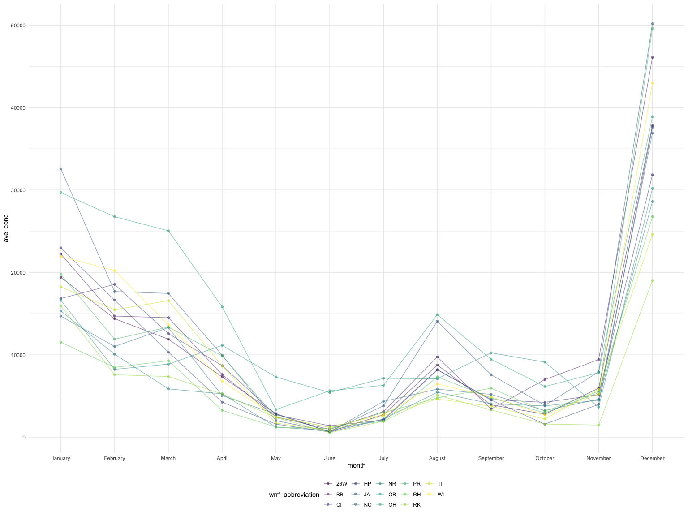
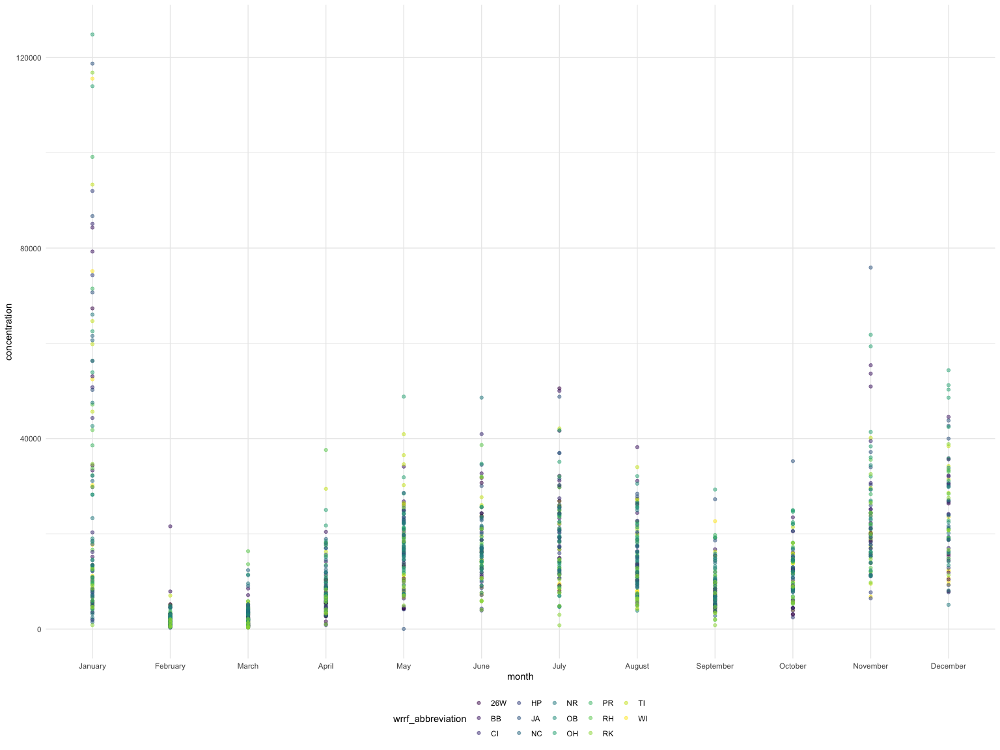
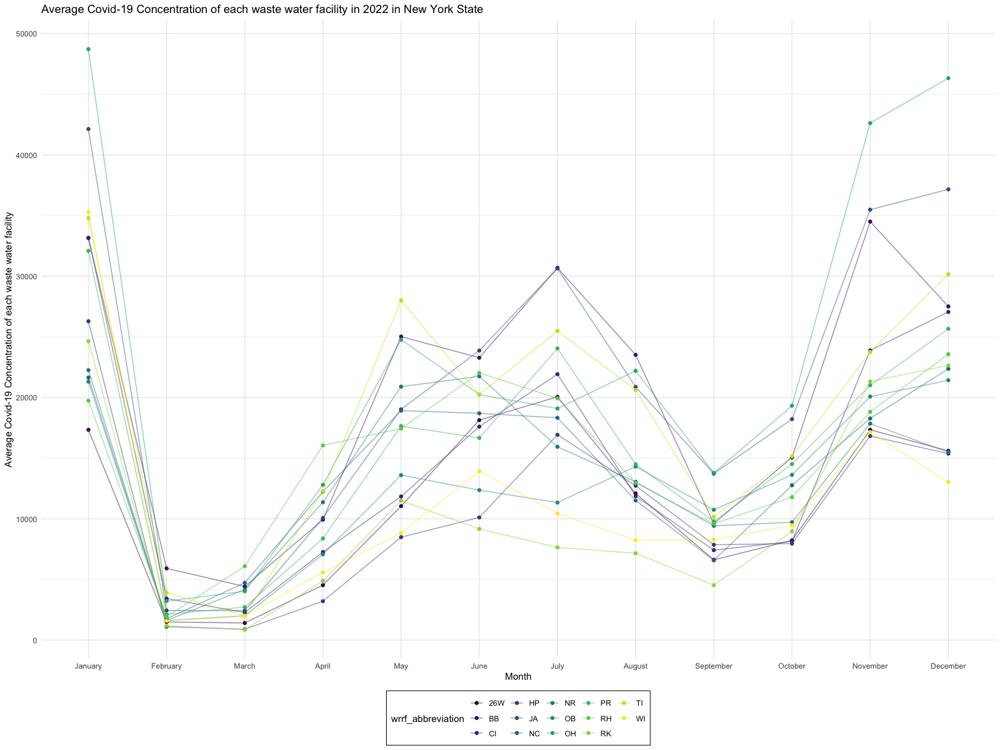

Final
================
Jianing Liu
2023-11-29

``` r
map <-
  read_csv("data/HydroWASTE_v10.csv")
```

    ## Rows: 58502 Columns: 25
    ## ── Column specification ────────────────────────────────────────────────────────
    ## Delimiter: ","
    ## chr  (5): WWTP_NAME, COUNTRY, CNTRY_ISO, STATUS, LEVEL
    ## dbl (20): WASTE_ID, SOURCE, ORG_ID, LAT_WWTP, LON_WWTP, QUAL_LOC, LAT_OUT, L...
    ## 
    ## ℹ Use `spec()` to retrieve the full column specification for this data.
    ## ℹ Specify the column types or set `show_col_types = FALSE` to quiet this message.

``` r
wwtp <-
  read_csv("data/SARS-CoV-2_concentrations_measured_in_NYC_Wastewater_20231129.csv")
```

    ## Rows: 4270 Columns: 9
    ## ── Column specification ────────────────────────────────────────────────────────
    ## Delimiter: ","
    ## chr (6): Sample Date, Test date, WRRF Name, WRRF Abbreviation, Annotation, T...
    ## num (3): Concentration SARS-CoV-2 gene target (N1 Copies/L), Per capita SARS...
    ## 
    ## ℹ Use `spec()` to retrieve the full column specification for this data.
    ## ℹ Specify the column types or set `show_col_types = FALSE` to quiet this message.

``` r
map_new <-
  map |>
  janitor::clean_names() |>
  select(waste_id, wwtp_name, lat_wwtp, lon_wwtp) |>
  mutate(wrrf_abbreviation = recode( wwtp_name,
    "New York C   Rockaway WPCP" = "RK",
    "New York C   Red Hook WPCP" = "RH",
    "New York C   Port Richmond WPCP" = "PR",
    "New York C   Oakwood Beach WPCP" = "OB",
    "New York C   26th Ward WPCP" = "26W",
    "New York C   Tallman Island WPCP" = "TI",
    "New York C   North River WPCP" = "NR",
    "New York C   Coney Island WPCP" = "CI",
    "New York C   Jamaica WPCP" = "JA",
    "New York C   Hunts Point WPCP" = "HP",
    "New York C   Owls Head WPCP" = "OH",
    "New York C   Bowery Bay WPCP" = "BB",
    "New York C   Newtown Creek WPCP" = "NC",
    "New York C   Wards Island WPCP" = "WI",
  ))
```

``` r
wwtp_cleaned <-
  wwtp |>
  janitor:: clean_names()
```

``` r
merge_df <- inner_join(map_new, wwtp_cleaned, by = "wrrf_abbreviation")
```

``` r
nyc_wwtp <-
  merge_df |>
  rename(concentration = concentration_sars_co_v_2_gene_target_n1_copies_l) |>
  drop_na(concentration) |>
  separate(sample_date, into = c("month", "day", "year"), convert = TRUE) %>% 
   mutate(
     year = as.character(year),
     month = factor(month, levels = 1:12),
     month = recode(month,
                        "1" = "January",
                        "2" = "February",
                        "3" = "March",
                        "4" = "April",
                        "5" = "May",
                        "6" = "June",
                        "7" = "July",
                        "8" = "August",
                        "9" = "September",
                        "10" = "October",
                        "11" = "November",
                        "12" = "December")) |>
  select(-waste_id, -test_date, -per_capita_sars_co_v_2_load_n1_copies_per_day_per_population, -population_served_estimated, -wwtp_name)

nyc_wwtp
```

    ## # A tibble: 4,129 × 10
    ##    lat_wwtp lon_wwtp wrrf_abbreviation month   day year  wrrf_name concentration
    ##       <dbl>    <dbl> <chr>             <fct> <int> <chr> <chr>             <dbl>
    ##  1     40.8    -73.9 WI                Augu…    31 2020  Wards Is…          1339
    ##  2     40.8    -73.9 WI                Sept…     8 2020  Wards Is…          1065
    ##  3     40.8    -73.9 WI                Sept…    13 2020  Wards Is…           394
    ##  4     40.8    -73.9 WI                Sept…    15 2020  Wards Is…           316
    ##  5     40.8    -73.9 WI                Sept…    20 2020  Wards Is…          1250
    ##  6     40.8    -73.9 WI                Octo…     6 2020  Wards Is…          1152
    ##  7     40.8    -73.9 WI                Octo…    11 2020  Wards Is…           600
    ##  8     40.8    -73.9 WI                Octo…    13 2020  Wards Is…          2066
    ##  9     40.8    -73.9 WI                Octo…    18 2020  Wards Is…           444
    ## 10     40.8    -73.9 WI                Octo…    20 2020  Wards Is…          3026
    ## # ℹ 4,119 more rows
    ## # ℹ 2 more variables: annotation <chr>, technology <chr>

Sub dataset

``` r
rtqpcr <-
  nyc_wwtp |>
  filter(year %in% c(2021, 2022), technology == "RT-qPCR") |>
  select(-lat_wwtp, -lon_wwtp, -annotation)

dpcr <-
  nyc_wwtp |>
  filter(year %in% c(2021, 2022), technology == "dPCR") |>
  select(-lat_wwtp, -lon_wwtp, -annotation)
```

dpcr is not large enough to do data analysis.

data analysis

``` r
trend_plot <-
  rtqpcr |>
  filter(year == 2021) |>
  group_by(month, wrrf_abbreviation) |>
  summarise(ave_conc = mean(concentration)) |>
  ggplot(aes(x = month, y = ave_conc, color = wrrf_abbreviation, group = wrrf_abbreviation)) +
  geom_line(alpha = .5) +
  geom_point(alpha = .5)
```

    ## `summarise()` has grouped output by 'month'. You can override using the
    ## `.groups` argument.

``` r
trend_plot
```



``` r
nyc_wwtp |>
  filter(year == 2022, technology == "RT-qPCR") |>
  group_by(month, wrrf_abbreviation) |>
  ggplot(aes(x = month, y = concentration, color = wrrf_abbreviation)) +
  geom_point(alpha = .5)
```



``` r
avg_concentration_2022 = 
  rtqpcr |> 
  filter(year == 2022) |>
  group_by(month, wrrf_abbreviation) |> 
  summarise(data_value_avg = mean(concentration))
```

    ## `summarise()` has grouped output by 'month'. You can override using the
    ## `.groups` argument.

``` r
avg_concentration_2022 |> 
  ggplot(aes(x = month, y = data_value_avg, color = wrrf_abbreviation, group = wrrf_abbreviation)) + 
  geom_line(alpha = .5) +
  geom_point() + 
  labs(x = "Month", 
       y = "Average Covid-19 Concentration of each waste water facility", 
       title = "Average Covid-19 Concentration of each waste water facility in 2022 in New York State") + 
  theme(legend.position = "bottom",
        legend.box.background = element_rect())
```



\##Questions 1 The concentration of covid for each station on average 2
literature review foe two diff tech (RT-qPCR, dPCR) 3 Year 2021 and 2022
